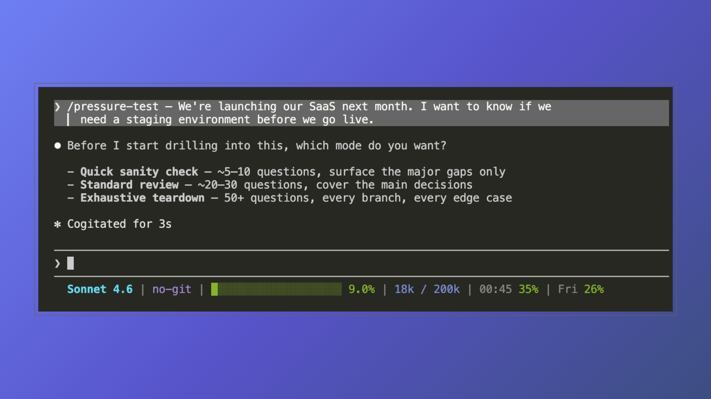
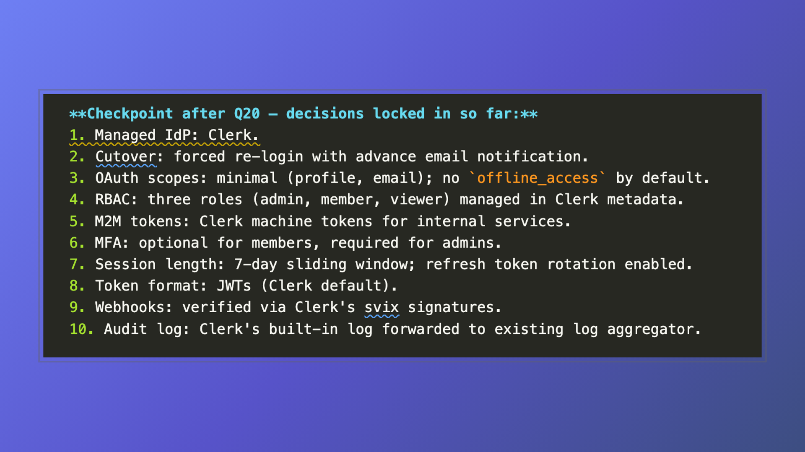

# pressure-test

Interviews you relentlessly about a plan, design, or proposal — branch by branch, one atomic question at a time — and ends with a consolidated decision artifact.

> Stop asking AI to review your plan. Start getting interrogated by it.



*Curious about the status bar on the screenshot above? Check it out [here](https://github.com/bitcoin21ideas/claude-statusline)*

## What it does

You describe a plan. The skill picks the first unresolved decision node, recommends an answer with brief reasoning, then asks you to confirm or override. It works down the decision tree until every meaningful branch is settled or you call it done. At the end it produces a written summary: every decision made, open questions, and recommended next actions — and, with your consent, saves those decisions to a `.decisions.md` file you can hand straight to [`to-plan`](../to-plan/README.md).

## Why

Ad-hoc "what do you think of my plan?" prompts produce encouraging summaries. This skill produces pressure: it surfaces gaps you didn't know were there, forces trade-off decisions before you commit, and gives you a written artifact you can act on.

## Compatibility

| Agent | Auto-invoke | Explicit invoke | Notes |
| --- | --- | --- | --- |
| Claude Code | Disabled | `/pressure-test` | `disable-model-invocation: true` honored |
| Claude.ai | Disabled | menu / mention | Same |
| Codex CLI | Possible | `$pressure-test` | Disable field not honored; description tuned to user-driven phrases |
| Copilot (VS Code) | Disabled | `/pressure-test` | Disable field honored |
| Gemini CLI | Varies | per docs | Unknown field ignored; falls back to description match |
| Cursor | Dynamic (description-based) | mention in prompt | Place skill folder in `.cursor/skills/`; `disable-model-invocation` field not honored — agent loads skills when it deems them relevant |

> [!NOTE]
> **Cursor note:** This skill is intentionally user-invoked — you generally don't want to be pressure-tested on random tasks. Cursor doesn't honor `disable-model-invocation`, so placement determines behavior. Put the skill folder in `.cursor/skills/` if you're comfortable with the agent loading it automatically when it judges the context relevant. For explicit-only control, place it anywhere else in the project (e.g. `.cursor/pressure-test/`) and `@`-mention `SKILL.md` in chat when you want to invoke it.

> [!TIP]
> **Prefer automatic invocation?** If you'd rather have your agent trigger this skill on its own, remove `disable-model-invocation: true` from the frontmatter, or broaden the description to include phrases the agent would naturally match on. Both changes are in `SKILL.md`.

## Install

**GitHub CLI (recommended)** — installs into whichever agent you use:

```sh
gh skill preview bitcoin21ideas/skills pressure-test   # inspect
gh skill install bitcoin21ideas/skills pressure-test   # install
```

**Ask your agent** — point it at this folder; `pressure-test` installs as-is, no tailoring:

> I like this skill — add it to my project:
> https://github.com/bitcoin21ideas/skills/tree/main/skills/pressure-test

(Needs an agent that can fetch URLs — Claude Code and Gemini CLI do by default. Have it read the **raw** `SKILL.md` into `.agents/skills/pressure-test/`; `examples/` are optional.)

**By hand** — see the [repo-level README](../../README.md#install) for per-agent paths.

## Modes

Choose at the start of the session:

| Mode | Questions | Use when |
| --- | --- | --- |
| Quick sanity check | ~5–10 | You want a fast gut-check on a rough idea |
| Standard review | ~20–30 | You have a real plan and want to find the gaps |
| Exhaustive teardown | 50+ | You want every branch resolved before committing |

In exhaustive mode, the skill recaps locked-in decisions every 20 questions. Quick and standard modes skip the recap — they're short enough not to need it.



## Sample sessions

| Mode | Example |
| --- | --- |
| Quick sanity check | [examples/quick-sanity-check.md](examples/quick-sanity-check.md) |
| Standard review | [examples/standard-review.md](examples/standard-review.md) |
| Exhaustive teardown | [examples/exhaustive-teardown.md](examples/exhaustive-teardown.md) |

## Peculiarities

- The skill **never implements anything during the interview**. No files are edited, no code is written until you explicitly approve the consolidated plan at the end. The closing question is always: *"Does this plan satisfy you? Should I implement it now?"*
- **Codex asks significantly more questions** than Claude in exhaustive mode. This is harness behavior, not a skill defect — Codex has higher question persistence by default. Expect ~30–50 questions from Claude and up to 70+ from Codex on the same plan.
- The skill **recommends before asking**. If you want pure open-ended interviewing with no leading answers, adjust the skill or ask your agent to do it.
- In agents that don't honor `disable-model-invocation`, the skill may auto-invoke on phrases like "pressure-test this" or "grill me". The description is tuned to user-action phrases specifically to limit this.

## Pairs with

- **[to-plan](../to-plan/README.md)** — synthesizes this session's decisions into an
  implementation-grade `plan.md`. If you saved a `.decisions.md` at the end of this
  session, pass it to `to-plan` in a fresh session.
- **[plan-clash](../plan-clash/README.md)** — hardens the plan `to-plan` produces. Run
  it after `to-plan`, not after `pressure-test` directly.

## Changelog

- **1.1.0** — After the closing question, the skill offers (consent-gated, never automatic) to save the session's distilled decisions — each with its rationale and rejected alternatives — to a `./<slug>.decisions.md` file, ready to hand to [`to-plan`](../to-plan/README.md).
- **1.0.0** — Initial public release. Adapted from the original [grill-me](https://github.com/mattpocock/skills/blob/main/skills/productivity/grill-me/SKILL.md) skill by Matt Pocock. Additions: depth calibration (quick / standard / exhaustive), recommendation-first format, codebase-first answering, summary checkpoints in exhaustive mode, consolidated plan output.
